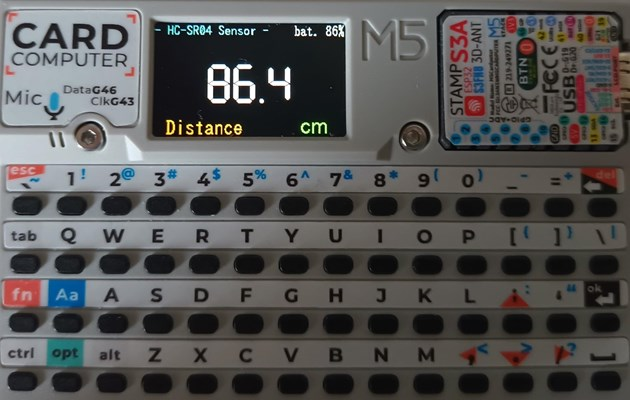

# HC-SR04-Cardputer
**[　日本語 (Japanese)　](README_jp.md)**

This is software for measuring distance using the HC-SR04 ultrasonic distance sensor with the M5Stack Cardputer.

 

## Key Features

*   **Real-time Distance Measurement**: Displays the distance measured by the HC-SR04 sensor in centimeters on the screen.
*   **Multi-language Support**: The display language can be switched between English and Japanese.
*   **Customizable Settings**:
    *   Screen brightness adjustment
    *   Low battery warning threshold setting
    *   Display language switching
*   **Settings Persistence**: Settings are automatically saved to the Cardputer's internal non-volatile memory (NVS) and are retained on the next startup.
*   **Power Saving Design**: Reduces battery consumption by disabling Wi-Fi and Bluetooth and optimizing the CPU frequency.
*   **Battery Protection**: Automatically shuts down when the battery level falls below the set threshold.
*   **SD Updater Support**: By pressing a specific key during startup, you can launch another application (`/menu.bin`) from the SD card.

## Requirements

*   M5Stack Cardputer
*   HC-SR04 Ultrasonic Distance Sensor
*   Connection cables (e.g., jumper wires)

## Wiring

Connect the HC-SR04 sensor to the Cardputer's Grove port (HY2.0-4P).

| Cardputer (Grove) | HC-SR04 | Notes                              |
| :---------------- | :------ | :--------------------------------- |
| G1 (GPIO 1)       | Echo    | `echoPin`                          |
| G2 (GPIO 2)       | Trig    | `trigPin`                          |
| 5V                | VCC     | Power                              |
| GND               | GND     | Ground                             |

## Installation

1.  Clone or download this repository.
2.  Install Visual Studio Code and the PlatformIO extension.
3.  Open this project folder in PlatformIO.
4.  Connect the Cardputer to your PC and run "Upload" in PlatformIO.

## How to Use

### Main Screen

*   **Center**: Displays the measured distance in cm. Shows `---.-` if out of range or an error occurs.
*   **Top Right**: Displays the remaining battery percentage (%).
*   **Bottom Left**: Displays the measurement item name (`Distance` or `距離`).

 
### Settings Mode

You can change various settings by pressing keys on the keyboard. The current setting is displayed on the second line from the top of the screen.

| Key | Function                               |
| :--- | :--------------------------------- |
| `1`  | Enter **Screen Brightness** setting mode |
| `2`  | Enter **Low Battery Threshold** setting mode |
| `3`  | Enter **Language** setting mode        |
| `` ` ``  | Exit settings mode and clear the display   |

### Changing Setting Values

In each setting mode, use the following arrow keys to change the value.

| Key | Cardputer Key | Function             |
| :--- | :------------ | :--------------- |
| ↑    | `;`           | Increase value (large step)   |
| ↓    | `.`           | Decrease value (large step)   |
| →    | `/`           | Increase value (small step)   |
| ←    | `,`           | Decrease value (small step)   |

*   In the **Language** setting, pressing any arrow key will switch the language.
*   Changed settings are saved automatically.

### Launching the SD Updater

While the Cardputer is booting, hold down the `a` key to launch `menu.bin` from the root of the SD card.

## License

This project is licensed under the MIT License.

## Author

NoRi
