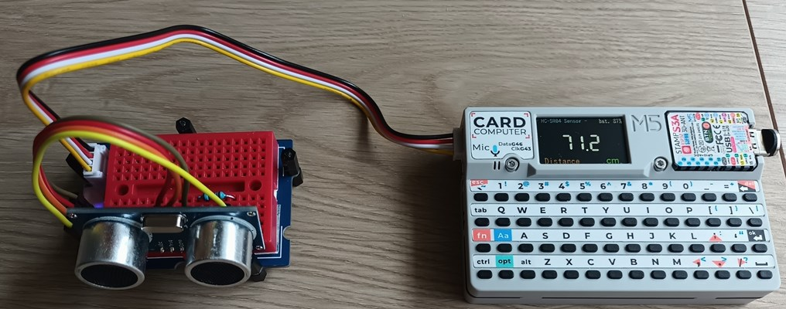

# HC-SR04-Cardputer
**[`　English　`](README.md)**

M5Stack Cardputerで超音波距離センサー HC-SR04 を使用して距離を測定するためのソフトウェアです。

 

## 主な機能

*   **リアルタイム距離測定**: HC-SR04センサーで測定した距離をcm単位で画面に大きく表示します。
*   **多言語対応**: 表示言語を英語と日本語で切り替え可能です。
*   **カスタマイズ可能な設定**:
    *   画面の明るさ調整
    *   低バッテリー警告のしきい値設定
    *   表示言語の切り替え
*   **設定の永続化**: 設定内容はCardputer内部の不揮発性メモリ（NVS）に自動で保存され、次回起動時も維持されます。
*   **省電力設計**: Wi-FiとBluetoothを無効にし、CPU周波数を最適化することで、バッテリー消費を抑えます。
*   **バッテリー保護**: バッテリー残量が設定したしきい値を下回ると、自動的にシャットダウンします。
*   **SDアップデーター対応**: 起動時に特定のキーを押すことで、SDカードから別のアプリケーション（`/menu.bin`）を起動できます。

## 必要なもの

*   M5Stack Cardputer
*   超音波距離センサー HC-SR04
*   接続用ケーブル（ジャンパーワイヤーなど）

## 接続

CardputerのGroveポート（HY2.0-4P）にHC-SR04センサーを接続します。

| Cardputer (Grove) | HC-SR04 | 備考                               |
| :---------------- | :------ | :--------------------------------- |
| G1 (GPIO 1)       | Echo    | `echoPin`                          |
| G2 (GPIO 2)       | Trig    | `trigPin`                          |
| 5V                | VCC     | 電源                               |
| GND               | GND     | グランド                           |

## インストール方法

1.  このリポジトリをクローンまたはダウンロードします。
2.  Visual Studio Code と PlatformIO 拡張機能をインストールします。
3.  PlatformIOでこのプロジェクトフォルダを開きます。
4.  CardputerをPCに接続し、PlatformIOの "Upload" を実行します。

## 操作方法

### 通常画面

*   **中央**: 測定された距離（cm）が表示されます。測定範囲外やエラーの場合は `---.-` と表示されます。
*   **右上**: バッテリー残量（%）が表示されます。
*   **左下**: 測定項目名（`Distance` または `距離`）が表示されます。

 
### 設定モード

キーボードのキーを押すことで、各種設定を変更できます。設定内容は画面上部の2行目に表示されます。

| キー | 機能                               |
| :--- | :--------------------------------- |
| `1`  | **画面の明るさ** の設定モードに移行 |
| `2`  | **低バッテリーしきい値** の設定モードに移行 |
| `3`  | **言語** の設定モードに移行        |
| `` ` ``  | 設定モードを終了し、表示をクリア   |

### 設定値の変更

各設定モードで、以下の矢印キーを使って値を変更します。

| キー | Cardputerキー | 機能             |
| :--- | :------------ | :--------------- |
| ↑    | `;`           | 値を大きく増加   |
| ↓    | `.`           | 値を大きく減少   |
| →    | `/`           | 値を小さく増加   |
| ←    | `,`           | 値を小さく減少   |

*   **言語設定**では、どの矢印キーを押しても言語が切り替わります。
*   変更した設定値は自動的に保存されます。

### SDアップデーターの起動

Cardputerの起動中にキーボードの `a` キーを押し続けると、SDカードのルートにある `menu.bin` を起動します。

## ライセンス

このプロジェクトは MIT License の下で公開されています。

## 作者

NoRi

